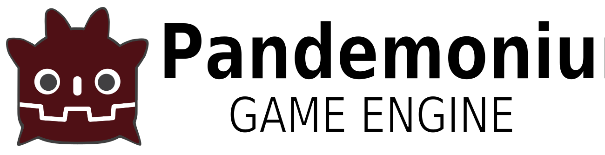

# Pandemonium Engine

  

A 3.x [Godot Engine](https://godotengine.org) fork where I hack and slash and cause mayhem and destruction to all things good and godot.

Similar idea going from godot 3.x to godot 4.x, but taken in a completely different direction.

Currently this engine is a weird amalgamation of godot 3.x, 4.x, and lots of custom features.

Most of the design decisions went into making everything simple for people that knows (or wants to know) what is going on. 

It contains all of my currently in use engine modules.

See the [changelog](https://github.com/Relintai/pandemonium_engine/blob/master/CHANGELOG.md) for a more comprehensive list of changes.

## 2D and 3D cross-platform game engine

Pandemonium Engine is a feature-packed, cross-platform game engine to create 2D and 3D games from a unified interface.
It provides a comprehensive set of common tools, so that users can focus on making games
without having to reinvent the wheel. Games can be exported with one click to a
number of platforms, including the major desktop platforms (Linux, macOS,
Windows), mobile platforms (Android, iOS), as well as Web-based platforms
(HTML5) and [consoles](https://github.com/Relintai/pandemonium_engine_docs/blob/master/03_usage/13_platform/01_consoles.md).

## Free, open source

Pandemonium is completely free and open source under the very permissive 
[MIT license](https://github.com/Relintai/pandemonium_engine/blob/master/LICENSE.txt).
No strings attached, no royalties, nothing. The users' games are theirs, down
to the last line of engine code.

Pandemonium's development is fully independent.

### Godot

Before being open sourced in [February 2014](https://github.com/godotengine/godot/commit/0b806ee0fc9097fa7bda7ac0109191c9c5e0a1ac),
Godot had been developed by [Juan Linietsky](https://github.com/reduz) and
[Ariel Manzur](https://github.com/punto-) (both still maintaining the project) for several
years as an in-house engine, used to publish several work-for-hire titles.

### Pandemonium

The Godot engine developers decided to remove the GLES2 backend in Godot 4.x so they can pursue the more modern graphics API-s.

After quite a while of thinking and experimentation however I decided that I still need (and want) the GLES2 renderer for my games,
I also needed some of the new features from godot 4.x.

So in early 2022 I decided that I'll fork godot 3.x, and backport anything that I
need for my games / projects. While here I also used the opportunity to modularize the engine more, 
and fix issues I had with it. I also added my engine modules to it by default, and
ended up writing lots of custom things.

Keep in mind, that I'm not really an engine dev. Which probably sounds completely bonkers from someone who develops and maintains his own
godot fork almost non-stop. What I mean is that this engine is being developed to be used by my other projects. This brings some downsides,
as this project cannot openly accept anything that anyone wants (like other engines). Fortunately this has never been an issue,
as I don't really try to get people to use this engine, but if this ever becomes a problem I'll create an official "community edition"
fork, that is much more open to outside influences.

This being said, the engine actually tries to be modular as much as possible, while being also easily extendible, and as simple to understand
and use as possible with a wide selection of platforms. All this without constraints that make building apps with the
required complexities of today harder than they need to be.

## Getting the engine

### Binary downloads

You can download binaries from the github actions tab [[here]](https://github.com/Relintai/pandemonium_engine/actions), 
or the releases tab [[here]](https://github.com/Relintai/pandemonium_engine/releases).

### Compiling from source

[See the official docs](https://github.com/Relintai/pandemonium_engine_docs/tree/master/05_engine_development/01_compiling)
for compilation instructions for every supported platform.

## Documentation and demos

The documentation is available [[Here]](https://github.com/Relintai/pandemonium_engine_docs).
It includes all official pandemonium demos.

The class docs are accessible from the editor.

You can also look at the official 3.x Godot documentation, it will work mostly (sometimes with trivial modifications). 

It's also worth looking at official godot 3.x resources, like this [awesome Godot list](https://github.com/godotengine/awesome-godot),
and there are also a number of other [godot learning resources](https://docs.godotengine.org/en/latest/community/tutorials.html)
provided by the community, such as text and video tutorials, demos, etc.

